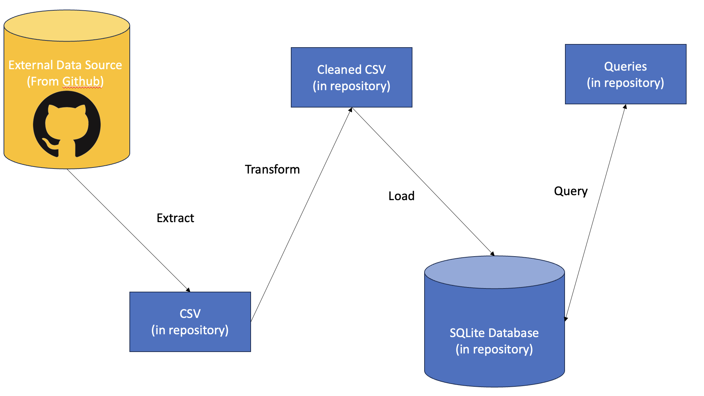
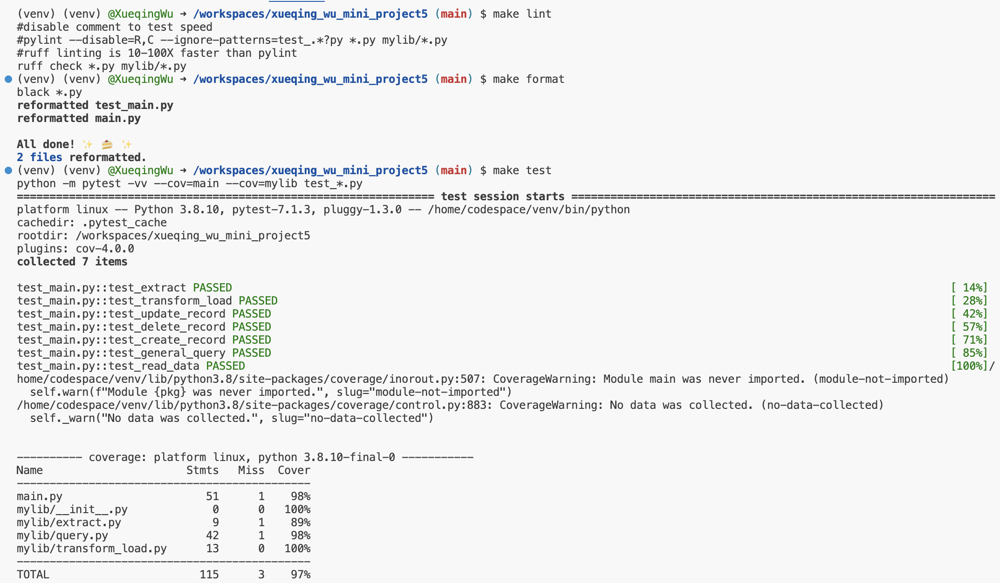

## Purpose
The goal of this project is to create a database on the cloud using Azure Databricks. Create data pipelin (ETL) and write query (including join, aggregation, and sorting).

Dataset source: Birth data from github (https://github.com/fivethirtyeight/data)

Birth data: https://github.com/fivethirtyeight/data/blob/master/births/US_births_2000-2014_SSA.csv?raw=true

The data is splitted into 2 datasets by splitting the column in order to join the datasets later

## Items Included
1. external data (birth data)
1. mylib
    1. extract.py
    1. transform_load.py
    1. query.py
1. main.py, test_main.py

## Steps
1. Find the data on Github
1. Extract: import the data in extract.py from Github
1. Transform and load: clean and load the data by creating a database and a table
1. Query: query the data including join, aggregate and sort
1. Update the Makefile 

## Workflow

## Tests

